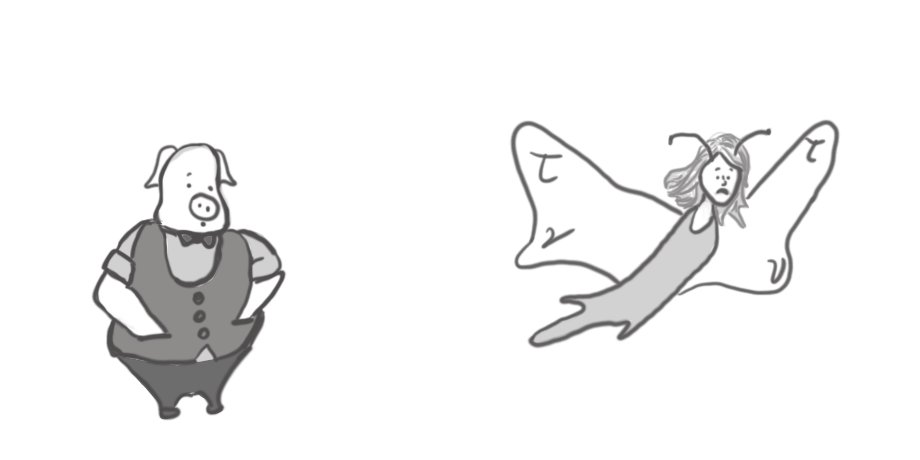
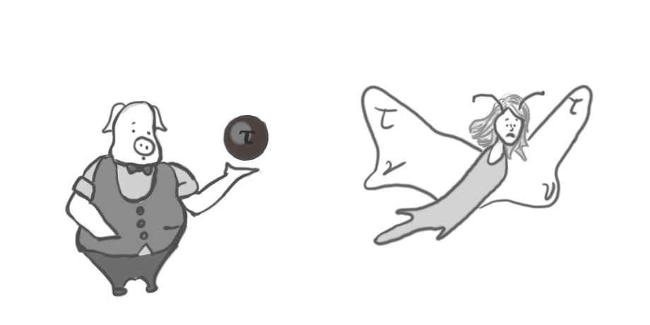

Title: A Tauists Hunt For Higgles (part one)
Date: 2018-09-18 15:16
Modified: 2018-09-18 15:16
Category: Physics
Tags: Higgs mechanism, outreach, animation, theory
Slug: ATauistsHuntForHiggles
Authors: Vince "the higgler" Croft
Summary: For my PhD defence I was asked to explain my research at a level that my mother would understand... the result was cartoon pigs.

# A Tauists Hunt For Higgles (part one)

We begin with an explanation of nomenclature; a description of an evolution of grammar. When new terms become established and their names become more common place, the descriptive additional words start to become implied, eventually to become superfluous. 

This is Higgle Wiggle. Higgle wiggle is not a Higgs boson, he is a picture of a Higgs boson. A subtle difference but an important one. A new bosonic resonance was discovered in 2012 that fits the description of the Higgs boson. In the years since its discovery, Higgs hunters and Higgs theorists have begun to drop the word boson when referring to the Higgs. But one Higgs, a measurement makes not. So it progresses: one Higgs, two Higgles and a Higgledy Piggledy of Higgles.

But how does this picture differ from the 'real' thing? Well the picture is a manifestation of our understanding of reality designed to relate the characteristics of the thing into an single entity that can be described be someone who has never met Higgle Wiggle before. The standard model of particle physics is just that, a model. A picture that relates the characteristics of what we see in our detector to the underlying mathematics of the universe. 

Ok but how do we get from this picture to a better understanding of the Higgs? Logic. So let's apply some!

Higgle Wiggle lives in the smallest space that we can see. Imagine a creature so small that the lines that form your fingerprints form the towering city blocks of the sprawling metropolis it calls home. Now imagine this creature looks down at the protein strands of its ganglia and pictures the city scape formed by a single nucleus in a single atom. That's where Higgle wiggle lives.

Now let's say Higgle wiggle wants to communicate with a tau neutrino: he can't shout; at these small scales theres no air for the sound waves to vibrate through, nor do our point source particles have mouths to speak or ears to hear. Our particles can't wave (even if they had arms) since light at this scale acts as a particle in its own right. But even worse, some particles only speak certain languages. e.g. only particles with electrical charge can interact with photons (light particles). The neutrino is neutral. The neutrino only interacts weakly and even then it also restricts itself to making sure that it doesn't interact unless another tauish particle is also present. So there it is. In order for Higgle Wiggle to influence or interact with a tau neutrino it must rip off a part of itself in the form of a tau lepton and throw it at the neutrino.

But the standard model is built from symmetries and conservations. When the negatively charged tauish lepton leaves the Higgs what remains must be positive and also tauish. What remains is an anti-tau lepton. But by the same token the neutrino is also changed, leaving behind only a weekly interacting particle with the electrical charge of the tau lepton.

 

